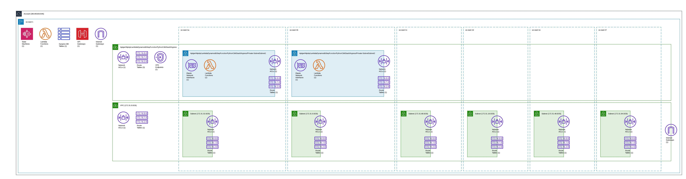
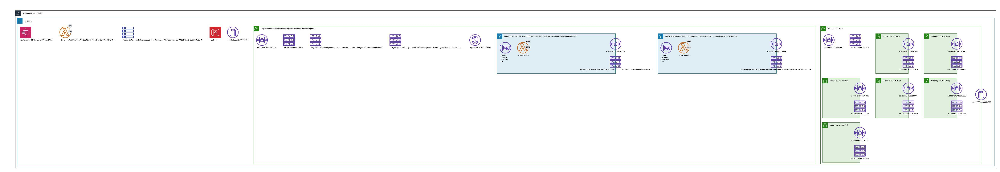
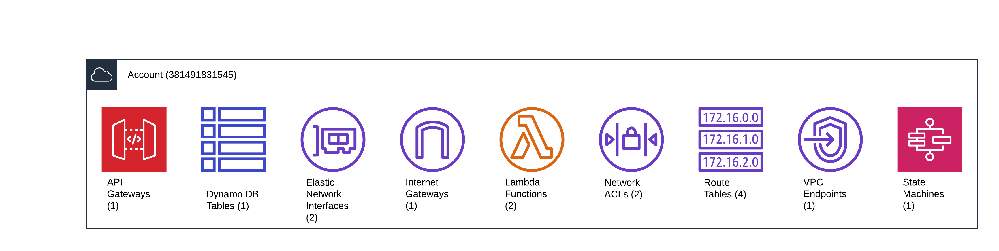
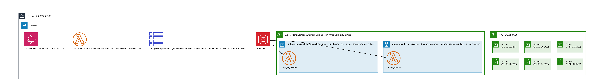

# CDK Code for AWSLambda invokded by AWS Step Functions and reading/writing data from DynamoDB.


## Overview

Creates an [AWS Lambda](https://aws.amazon.com/lambda/) function writing/reading to/from [Amazon DynamoDB](https://aws.amazon.com/dynamodb/) and invoked by [Amazon API Gateway](https://aws.amazon.com/api-gateway/) REST API or [AWS Step Function](https://aws.amazon.com/step-functions/). 

### Architecture : 
Summarized Infrastructure : 


Infrastructure : 


Resources : 


Serverless : 


## Setup

The `cdk.json` file tells the CDK Toolkit how to execute your app.

This project is set up like a standard Python project.  The initialization
process also creates a virtualenv within this project, stored under the `.venv`
directory.  To create the virtualenv it assumes that there is a `python3`
(or `python` for Windows) executable in your path with access to the `venv`
package. If for any reason the automatic creation of the virtualenv fails,
you can create the virtualenv manually.

To manually create a virtualenv on MacOS and Linux:

```
$ python3 -m venv .venv
```

After the init process completes and the virtualenv is created, you can use the following
step to activate your virtualenv.

```
$ source .venv/bin/activate
```

If you are a Windows platform, you would activate the virtualenv like this:

```
% .venv\Scripts\activate.bat
```

Once the virtualenv is activated, you can install the required dependencies.

```
$ pip install -r requirements.txt
```

At this point you can now synthesize the CloudFormation template for this code.

```
$ cdk synth
```

To add additional dependencies, for example other CDK libraries, just add
them to your `setup.py` file and rerun the `pip install -r requirements.txt`
command.

## Deploy
At this point you can deploy the stack. 

Using the default profile

```
$ cdk bootstrap
$ cdk deploy
```


## After Deploy
Navigate to AWS API Gateway console and test the API with below sample data 
```json
{
    "year":"2024", 
    "title":"some data here",
    "id":"123456"
}
```

#### To Invoke the lambda function using the AWS Step function :
- Go to AWS Console --> AWS Stepfunctions --> State Machine --> Select the machine and Click "Start Execution"

#### To Invoke the lambda function using AWS API Gateway : 
- Using CLI : 

```bash
curl -X POST \
  https://{api-id}.execute-api.{region}.amazonaws.com/prod/ \
  -H "Content-Type: application/json" \
  -d '{
        "year": 2024,
        "title": "Example Title here",
        "id": "Enter unique-id here"
      }'
```

You should get below response  for adding data : 

```json
{"message": "Successfully inserted data!"}
```

####  To get the values/data from DynamoDB :
- Using CLI :

```bash
curl -X GET \
  https://{api-id}.execute-api.{region}.amazonaws.com/prod/ 
```

- Using Browser :  https://{api-id}.execute-api.{region}.amazonaws.com/prod/ 

---


## Cleanup 
Run below script to delete AWS resources created by this sample stack.
```
cdk destroy
```

## Useful commands

 * `cdk ls`          list all stacks in the app
 * `cdk synth`       emits the synthesized CloudFormation template
 * `cdk deploy`      deploy this stack to your default AWS account/region
 * `cdk diff`        compare deployed stack with current state
 * `cdk docs`        open CDK documentation

